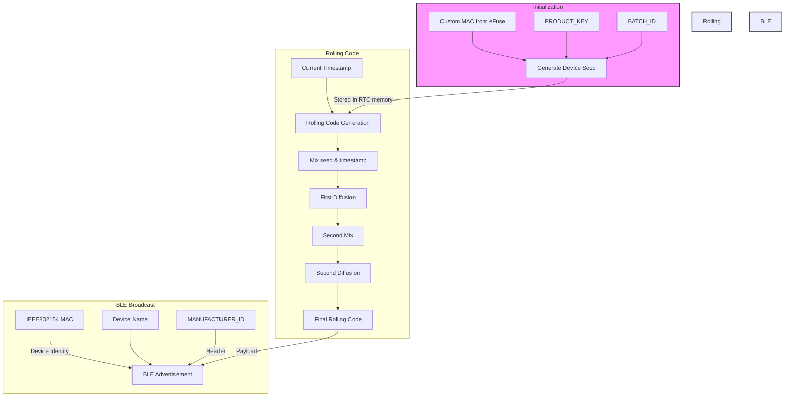

# Rolling Code Generation & MAC Address Usage



## MAC Address Overview

The system uses two different MAC addresses for different purposes:

1. **Custom MAC Address** (`00:60:2F:15:71:61`)
   - Set using eFuse command: `espefuse.py --chip esp32h2 burn_custom_mac <A CUSTOM UNI CAST MAC ADDR>` or use [burn_custom_mac.sh](custom_mac_burner/burn_custom_mac.sh)
   - Stored in eFuse BLOCK3
   - Used as input for device seed generation
   - Read using `getMacAddressEx()` function

2. **IEEE802154 MAC** (`74:4D:BD:FF:FE:60`)
   - Factory-programmed MAC address
   - Used as BLE device identifier
   - Visible in BLE scanning tools (e.g., nRF Connect)

## Setting Custom MAC Address

1. Connect ESP32-H2 via USB
2. Run eFuse command:

   ```bash
   espefuse.py --chip esp32h2 --port <PORT> burn_custom_mac <CUSTOM_MAC>
   ```

3. Verify with:

   ```bash
   espefuse.py --chip esp32h2 --port <PORT> get_custom_mac
   ```

> We have a convenient script that does that and more: [burn_custom_mac.sh](custom_mac_burner/burn_custom_mac.sh)

---

## Rolling Code Generation Process

### 1. Device Seed Generation

- **Inputs:**
  - Custom MAC (from uC's eFuse)
  - PRODUCT_KEY (from `secret.h`)
  - BATCH_ID (from `secret.h`)
- **Process:**
  
  ```cpp
  seed = PRODUCT_KEY;
  seed ^= (BATCH_ID << 16);
  seed ^= ((macAddr[0] << 24) | (macAddr[1] << 16) | 
           (macAddr[2] << 8) | macAddr[3]);
  ```

### 2. Rolling Code Generation

- **Inputs:**
  - Device Seed
  - Current Timestamp (24-bit)
- **Process:**
  - Mix device seed with timestamp
  - Apply multiple diffusion operations
  - Result: 32-bit rolling code

### 3. BLE Broadcasting

- **Packet Structure:**
  - Device Name: "HELP by JENNYFER"
  - BLE Identity: IEEE802154 MAC (all same for all esp32-h2s)
  - Payload: Rolling code (4 bytes)
  - Header: MANUFACTURER_ID (from `secret.h`)
