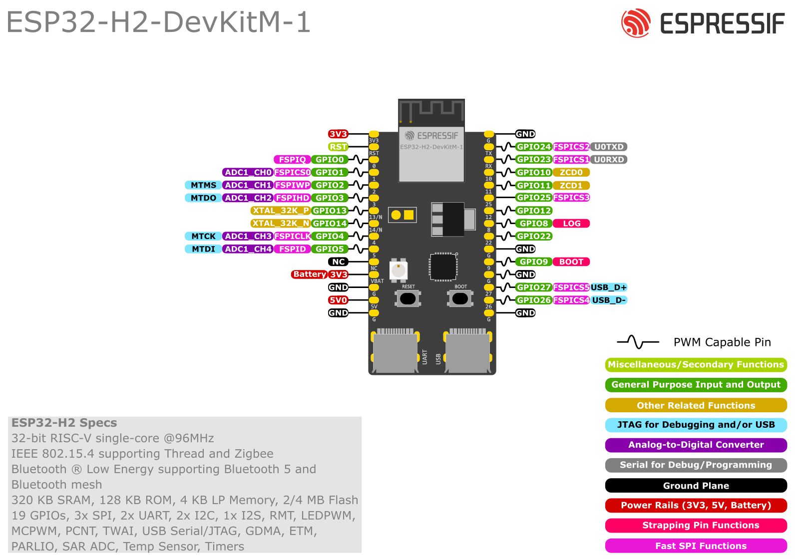

# Firmware

| Type | Status |
|------|---------|
| Build status | [](https://github.com/dattasaurabh82/help-button-firmware/actions/workflows/build_main_firmware.yml) |

---

## File Structure

```txt
├── BLE_SECURITY.md
├── LICENSE
├── POWER_OPTIMIZATION.md
├── README.md
├── assets/
├── button_firmware/
│   ├── SECURE_BOOT.md
│   ├── binary/
│   ├── button_firmware.ino
│   ├── debug_led.h
│   ├── debug_log.h
│   ├── secrets.h
│   ├── secrets_template.h
│   ├── secure_boot_process.sh
│   └── secure_boot_signing_key.pem
├── custom_mac_burner
│   ├── README.md
│   └── burn_custom_mac.sh
└── webflasher
    ├── assets
    │   ├── css
    │   │   └── styles.css
    │   ├── favicon.ico
    │   ├── js
    │   │   └── main.js
    │   └── logo_black_fullname.png
    ├── firmware
    │   └── button_firmware.merged.bin
    ├── index.html
    └── manifest.json
```

1. The main firmware directory is: [main/](main/) .
2. The arduino code within the main firmware dir is here [button_firmware/](main/arduino) .
3. The compiled binaries are stored in [button_firmware/binary/](button_firmware/binary/)
4. [webflasher/](webflasher/) hosts files for a _web firmware installer_ website for flashing the __*latest__ firmware to our esp32-h2 modules, from a webiste hosted in gh-pages.

   > __It uses [ESP Web Tools](https://esphome.github.io/esp-web-tools/)__. More details about its usage and implementation will follow later.

## Automations and CI/CD pipelines

<details>
<summary> Details </summary>

1. An automation flow to  [build releases](.github/workflows/build_main_firmware.yml) from the source code as binary files, is triggered by new unique tag pushes.

> __This also commits and pushes the binaries to the repository itself in [button_firmware/binary/](button_firmware/binary/)__

```bash
git tag v0.0.x
git push -u origin v0.0.x
# Will create a new tag and a new release
```

[](https://mermaid.live/edit#pako:eNqVVVtP2zAU_iuWERNMLaNNW2geJkG5TgxFLesDaR_c-KSxSOzIsYEO9b_PcRyaskpszUOPc873nbvzhiNBAfs4TsVLlBCp0MPFjCOEJsocDsJAFwl6IEv0_PXIPPND1G5_R1OSMkoU_BCLsJaROcxn3IILvVhKkie7DUu6KyEzoubWuvxNO-EogegJKaOMG0rg1JE2uGwQY0iBFJbaiTtD2GEWSBFBUWy8jwSP2dKynmuWUiuNRJYx1XTlqFGTvoKG1Z-WgC75M5OCZ8Ab6VknLkWhFSqrPq-8dMNbXiiSpuhMUs24QKO7W6fz3nWXk8DrGpisYb0NjJJYaobuQeTsFVJ0xxYbz5v6bYVt0wyrZK-YzF6IYd4K9_w4HEko-_UF5SLXaSkSE4ItVQKEgkQxS11A5yY7UyT-LapAC8aJXCHKpNN3TY2y3NgbkPNnFdtOvXAKksWrGl86KBxDzzSQkwy2dZ9lWrUxdN0knKJypj-0Jug0OrhkyhU56IZnlO6I5QPaq-nNCvFlbTQKetX-KIEywnj9th_-yu0imFn_NHw3enUv3HE7_HGnVtelRY-3QeVu3A2vgYNsgNG9UDsTGXs1zzVTN3rxtzcb5Fawm_WyfJecHmz2TC9SViRA54f1VqqVGQB7t5TlTP29eDBoFUqKJ_D3PM9zcvuFUZX43fy1ATPcDjSMh_8Kat4aFTiK4k_A-_voHd_Iz8FP4_8PuN-PcQtnYO41Rs11-1ZazbBKIIMZ9o1IiXya4RlfGzuilZiseIR9JTW0sBR6mWA_JmlhTtoOzwUjZkCy97c54Y9CZDXEHLH_hl-xf9zCK-yf9I9OBoPe6dAbdobHXm_dwr-teaeFgTIl5M_qQ2C_B-s_sgrwnA)

1. If the above step completes successfully, it uses the latest compiled firmware binary to update the firmware flasher website ([custom gh-pages hosting workflow](.github/workflows/pages.yml)) and deploys the Web Flasher interface to GitHub Pages. Thus, it can be triggered manually (takes the last releae tag, automatiocally) or gets trigerred automatically after a successful firmware build.


</details>

## Hardware Preparation

<details>
<summary>"Why ESP-32", you may ask</summary>

We have chosen [ESP32-H2-MINI-1](https://www.espressif.com/sites/default/files/documentation/esp32-h2-mini-1_mini-1u_datasheet_en.pdf) for its natural advantages:

1. The ESP family is developer-friendly, with the ESP SDK being widely supported across various frameworks like Arduino and PIO, in addition to ESP-IDF itself. This makes long-term development maintenance much easier.
2. This specific module has the lowest deep sleep power consumption in the entire ESP family (as of December 2024).
3. It is widely available and cost-effective.
4. Firmware flashing is simpler compared to previous microcontrollers, requiring no development environment. For example, web flashing capabilities mean factories can easily flash devices during mass production without setting up specific development environments.
5. It has a smaller footprint.
6. It features built-in BLE and WiFi, plus support for future protocols like Thread, making it future-proof.
7. It has all [necessary certifications](https://www.espressif.com/en/support/documents/certificates?keys=&field_product_value%5B%5D=ESP32-H2&field_product_value%5B%5D=ESP32-H2-MINI-1) for shipping radio-based consumer electronics.

</details>

<details>
<summary>Development module/kit</summary>

To test development and firmware, you can purchase [ESP32-H2-DevKitM-1](https://docs.espressif.com/projects/esp-dev-kits/en/latest/esp32h2/esp32-h2-devkitm-1/user_guide.html)




🛒 [Purchase link](https://amzn.eu/d/6zMkRbX)
</details>

<details>
<summary>Real hardware module</summary>

_WIP_ 


Front


Back


[Tooling] With ext-programmer for mass board wake-ups. 

</details>

---

## Firmware installation instructions

<details>
<summary>1. From the web (Just want to flash the firmware - Recommended and most straight forward)</summary>


1.1. Go to: https://dattasaurabh82.github.io/help-button-firmware/ and click "Connect". Of course, plug in your device first.


1.2. Select the correct serial port/COM port (in Windows)


1.3. Click "Install Button Firmware". The latest firmware is always there because of our automations (mentioned above).


1.4. Select "Erase device" to Erase the flash and then click "Next".


1.5. Click "Install" to start firmware flashing.


1.6. Now wait and follow the prompts and watch the progress.


1.7. After completion, open the serial port, for now, to check.

> If there are trouble, the UI will guide you on how to troubleshoot.

</details>

---

<details>
<summary>2. arduino-cli (Just want to flash the firmware - But from your local machine)</summary>

### 2.1. Install Arduino CLI

Follow the [Instructions from here](https://arduino.github.io/arduino-cli/1.1/installation/) for your platform (Pick the latest version from the top left drop down).

### 2.2. Install ESP32 boards

```bash
# Add the ESP32 boards URL
arduino-cli config add board_manager.additional_urls https://raw.githubusercontent.com/espressif/arduino-esp32/gh-pages/package_esp32_index.json

# Update the core index
arduino-cli core update-index

# Install the ESP32 core
arduino-cli core install esp32:esp32

# Install the Adafruit neopixel library
arduino-cli lib install "Adafruit NeoPixel"
```

### 2.3. Building and uploading the firmware

#### 2.3.1. Clone this repository to your local machine.

#### 2.3.2. Navigate to the [button_firmware](button_firmware) directory.

```bash
cd button_firmware
```

#### 2.3.3. Clean and create a new binary directory

```bash
rm -rf binary
mkdir -p binary
```

#### 2.3.4. Compile the firmware

```bash
arduino-cli compile -v --fqbn esp32:esp32:esp32h2:UploadSpeed=921600,CDCOnBoot=default,FlashFreq=64,FlashMode=qio,FlashSize=4M,PartitionScheme=default,DebugLevel=none,EraseFlash=none,JTAGAdapter=default,ZigbeeMode=default --output-dir binary .

# verify
cd binary && ls -la
```

#### 2.3.5. Upload the firmware

```bash
# Assuming you are in button_firmware 
# and a binary dir exists with the compiled binaries from the previous step
arduino-cli upload -v --fqbn esp32:esp32:esp32h2:UploadSpeed=921600,CDCOnBoot=default,FlashFreq=64,FlashMode=qio,FlashSize=4M,PartitionScheme=default,DebugLevel=none,EraseFlash=none,JTAGAdapter=default,ZigbeeMode=default --port /dev/your-serial-port binary/button_firmware.ino.merged.bin
```

> `--port /dev/your-serial-port`: Specifies the serial port to which the ESP32-H2 board is connected.
>
> Replace `/dev/your-serial-port` with the actual serial port name on your system (e.g., `/dev/ttyUSB0` on Linux, `COM3` on Windows).
>
> You can find the port name by running the `arduino-cli board list` command.

#### 2.3.6. Verify the firmware

TBD
</details>

---

<details>
<summary>3. Arduino IDE 2.3.4 (Easy for Development and want to look under the hood)</summary>

#### 3.1. Prerequisites

1. Install the latest Arduino IDE (version 2.3.4 or above) for your platform.
2. Open the Arduino IDE and navigate to the Board Manager.
3. From "boards", search for "esp32" and install the "esp32 by Espressif" (latest).
4. From "libraries", search for "Adafruit Neopixel" and install the latest neopixel library.

#### 3.2. Compile & upload

3.2.1. Clone this repository to your local machine.
3.2.2. Open the [button_firmware.ino](button_firmware/button_firmware.ino) file located in the [button_firmware](main) directory.
3.2.3. In the Arduino IDE, select the following board parameters:

   ```txt
   Board: ESP32-H2-Dev Module
   Upload Speed: 921600
   CDC On Boot: Disabled
   Flash Frequency: 64MHz
   Flash Mode: QIO
   Flash Size: 4MB (32Mb)
   Partition Scheme: Default 4MB (1.2MB APP/1.5MB SPIFFS)
   Erase Flash: Disabled
   JTAG Adapter: Disabled
   Zigbee Mode: Disabled
   ```

3.2.4. Select the appropriate USB Serial port for your device (in Win, make sure you ahve "xxx" drtiver installed and then select the right COM port; on mac and linux, you can ignore).
3.2.5. Click the Upload button to flash the firmware. It will compile and upload
</details>

---

<details>
<summary>4. Platform IO (If you are a pro and are keen in firmware development)</summary>
<br>
Copy one of the partitions file from `/Users/[USER]/.platformio/packages/framework-arduinoespressif32/tools/partitions` to the `button_firmware_pio/button_firmware_pio/` (i.e. root of the pio project dir)

Copy one of the partitions file from `/Users/[USER]/.platformio/packages/framework-arduinoespressif32/tools/partitions` to the `button_firmware_pio/button_firmware_pio/partitions/`

The pio project is located here: [button_firmware_pio](button_firmware_pio)

WIP & TBD

proper settings in [platformio.ini](button_firmware_pio/platformio.ini) is ongoing here: 

</details>

## Firmware logic


---

## Deep dives

### Key areas

1. [Power Saving](POWER_OPTIMIZATION.md)
2. [Rolling Code Security](BLE_SECURITY.md)
3. [Secure Boot](button_firmware/SECURE_BOOT.md)

## License

[GPL-3.0](LICENSE)

## Attribution

```txt
Saurabh Datta
Dec 2024
Berlin, Germany
```
